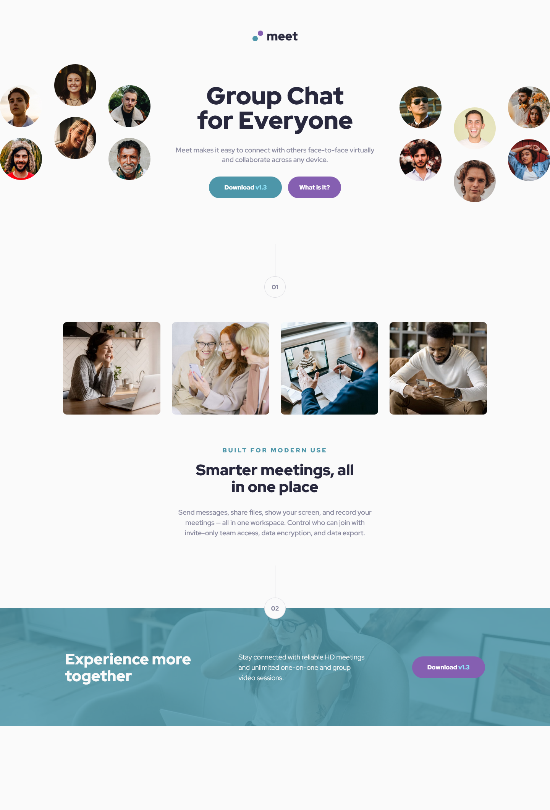
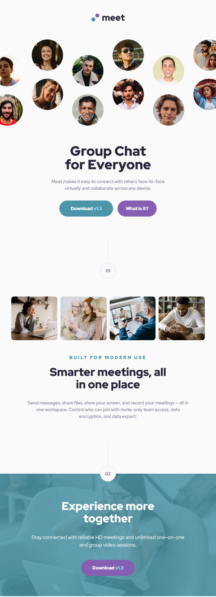

# Frontend Mentor - Meet landing page solution

This is a solution to the [Meet landing page challenge on Frontend Mentor](https://www.frontendmentor.io/challenges/meet-landing-page-rbTDS6OUR). Frontend Mentor challenges help you improve your coding skills by building realistic projects. 

## Table of contents

  - [The challenge](#the-challenge)
  - [Screenshot](#screenshot)
  - [Links](#links)
  - [Author](#author)

### The challenge

Users should be able to:

- View the optimal layout depending on their device's screen size
- See hover states for interactive elements

### Screenshot

### Links

- Solution URL: [solution URL](https://github.com/Giulo25/Meet-landing-page)
- Live Site URL: [live site URL](https://giulo25.github.io/Meet-landing-page/)

## My process
This is my first Frontend Mentor challenge 

## Author

- Website - [Simone Giulivi](https://www.simonegiulivi.com)
- Frontend Mentor - [@giulo25](https://www.frontendmentor.io/profile/giulo25)
